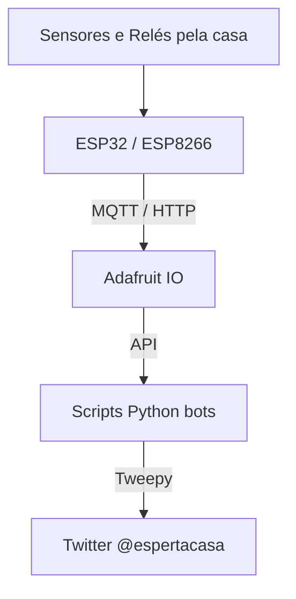

# CasaEsperta 🏠

> "Essa pessoa espalhou sensores pela própria casa, conectou tudo ao Adafruit IO, escreveu bots em Python e fez a própria casa — inclusive uma samambaia e os animais — conversar pelo Twitter."

## Sobre o projeto

O **CasaEsperta** foi um projeto pessoal de automação residencial e Internet das Coisas (IoT) que desenvolvi por volta de 2021. Ele nasceu em uma época anterior à popularização das ferramentas de IA generativa para programação, motivado puramente pela curiosidade, pela vontade de construir coisas e de aprender experimentando.

A ideia nunca foi ter apenas um sistema frio de automação. Eu queria que a casa ganhasse **personalidade**.

Para isso, conectei sensores, microcontroladores, APIs e scripts em Python a uma conta no Twitter ([@espertacasa](https://x.com/espertacasa)). A casa não apenas coletava dados de temperatura, chuva ou o estado das luzes; ela publicava acontecimentos do mundo físico, ganhava uma "voz" e interagia de maneira divertida.

Este repositório guarda os scripts originais desse projeto. Hoje, ele está **descontinuado** e mantido aqui exclusivamente como um **registro histórico** do meu aprendizado.

---

## Como a casa funcionava

A arquitetura geral do sistema foi construída conectando pequenos módulos pela casa a um hub central, que por sua vez alimentava bots no Twitter.

### Sensores e Dispositivos

Espalhei placas ESP32 e ESP8266 pela casa, conectadas a sensores de temperatura, umidade, chuva, umidade do solo e módulos de relé. Todo o hardware era montado manualmente, muitas vezes em protoboards, e o código era escrito pesquisando a documentação, errando e testando diretamente no hardware.

*Montagem de um dos módulos de leitura de temperatura na protoboard.*

*Um dos displays exibindo os dados locais.*

### O Cérebro: Adafruit IO

Todas essas placas não conversavam diretamente com o Twitter. Elas enviavam as informações para o **Adafruit IO**, que servia como a grande central de dados do projeto. Lá, havia um dashboard que permitia visualizar a situação atual da casa em tempo real e até mesmo controlar partes dela, como o acionamento de algumas luminárias.

*O painel principal (dashboard) no Adafruit IO, reunindo todos os feeds (temperatura, umidade, samambaia).*

*Configuração dos blocos e botões da interface no Adafruit.*

---

## A voz da casa: Os Bots no Twitter

A parte mais especial do projeto eram os scripts Python (como `Luminarias.py`, `TemperaturaInterna.py`, etc.). Eles rodavam periodicamente consultando os dados do Adafruit IO e gerando publicações na conta do Twitter do projeto.

As alterações de temperatura geravam tweets, novas máximas e mínimas disparavam avisos, e até mesmo quando as luzes eram acesas, a casa podia comentar.

### A samambaia que pedia água

Eu tinha uma samambaia em casa com um sensor de umidade inserido na terra do vaso. Quando a terra começava a secar e a umidade do solo atingia um nível crítico, o script `UmidadeSoloSamambaia.py` entrava em ação.

A própria planta ganhou uma voz e publicava no Twitter pedindo para alguém regá-la. E, claro, se alguém colocasse água, o sensor detectava a mudança e ela agradecia.

*O sensor de umidade posicionado no vaso da samambaia.*

*A samambaia pedindo água no Twitter.*

### O frio, os animais e o anti-spam de frases aleatórias

Quando fazia frio, os scripts de temperatura ganhavam uma camada extra de personalidade: as publicações utilizavam fotografias dos nossos próprios animais de estimação vestindo roupas de frio ou enrolados em cobertores. Era uma forma de materializar o "frio que estava fazendo" com algo familiar.

Além disso, havia um problema técnico a ser resolvido: o Twitter costumava classificar bots que postavam textos muito semelhantes (como "A temperatura é X") repetidamente como *spam*.

Para contornar isso de forma criativa (e rústica), o código tinha um mecanismo que adicionava **frases aleatórias** no final dos tweets. O resultado era maravilhoso: a casa informava dados meteorológicos reais com muita seriedade, e logo depois emendava uma frase completamente absurda, dando uma característica única e divertida ao bot.

*Informação do clima acompanhada de um cachorro no cobertor e uma das famosas frases aleatórias.*

*Os animais da casa eram os verdadeiros "âncoras" do nosso jornal meteorológico.*

*Exemplo das frases aleatórias cumprindo seu papel para evitar bloqueios por spam.*

---

## Estrutura do Código

Os scripts refletem a maneira como eu programava na época e estão intencionalmente preservados como foram escritos:

- `Luminarias.py` / `LuminariasT.py`: Monitoravam e informavam o status de acionamento das luzes.
- `TemperaturaExterna.py` / `TemperaturaInterna.py`: Consultavam e publicavam os dados climáticos.
- `UmidadeSoloSamambaia.py`: Dava vida à samambaia sedenta.
- `auth.py` *(apenas estrutura, sem credenciais reais)*: Arquivo de configuração de chaves de API (as senhas não estão no repositório nem no histórico).

---

## Estado Atual e Preservação

**Aviso Importante:** Este projeto é mantido apenas como um **registro histórico**.

- O sistema está **descontinuado**.
- As APIs utilizadas na época (especialmente a integração com o Twitter/X) sofreram mudanças drásticas e as bibliotecas antigas não funcionarão hoje em dia.
- Dependências e métodos estão obsoletos.
- O objetivo não é modernizar, mas preservar o código como ele existiu.

O valor do **CasaEsperta** não está na perfeição do código ou numa arquitetura imaculada. Está em representar uma etapa especial do meu aprendizado, sendo a memória de uma época onde minha casa, minha samambaia e meus cachorros dividiam uma conta no Twitter para conversar com a gente.

Você pode conferir a conta histórica do projeto (caso ainda exista) em: [@espertacasa no X](https://x.com/espertacasa).
