# CasaEsperta 🏠

O **CasaEsperta** foi um projeto pessoal de automação residencial que mantive por volta de 2021 na Casa Amarela.

A ideia começou com sensores, ESP32/ESP8266, relés e o Adafruit IO, mas acabou virando algo um pouco mais divertido: a casa ganhou uma conta no Twitter, [@espertacasa](https://x.com/espertacasa), e passou a contar o que estava acontecendo por aqui.

Temperatura, umidade, chuva, luzes acesas ou apagadas e até a umidade da terra de uma samambaia viravam dados no Adafruit IO e, em alguns casos, publicações feitas automaticamente por scripts em Python.

Este repositório guarda esses scripts como foram escritos na época. O projeto está encerrado e hoje permanece aqui como registro histórico — tanto do sistema quanto de uma fase muito importante do meu aprendizado com programação, eletrônica e IoT.

---

## Como funcionava

A estrutura era relativamente simples:

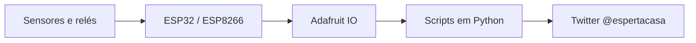

ESP32 e ESP8266 espalhados pela casa faziam a interface com sensores e relés. Os dados eram enviados ao **Adafruit IO**, que funcionava como ponto central entre o mundo físico e os scripts em Python.

Os scripts consultavam esses feeds e reagiam às mudanças: temperatura subindo ou descendo, valores máximos e mínimos, alterações nas luminárias e umidade do solo, por exemplo.

Boa parte disso foi montada em protoboard, testada diretamente no hardware e escrita na base de documentação, pesquisa, tentativa e erro.

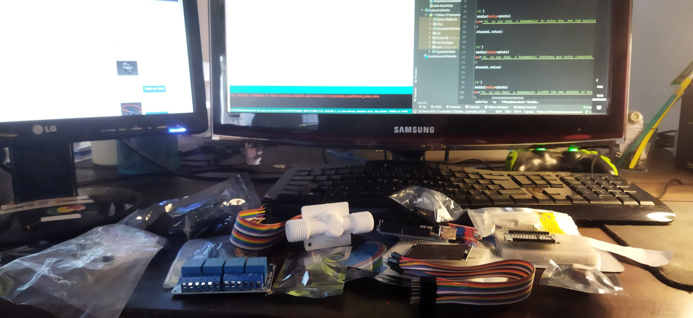

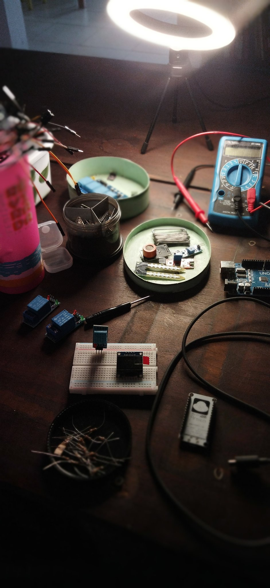

Um dos módulos também tinha um pequeno display OLED para mostrar os dados localmente:

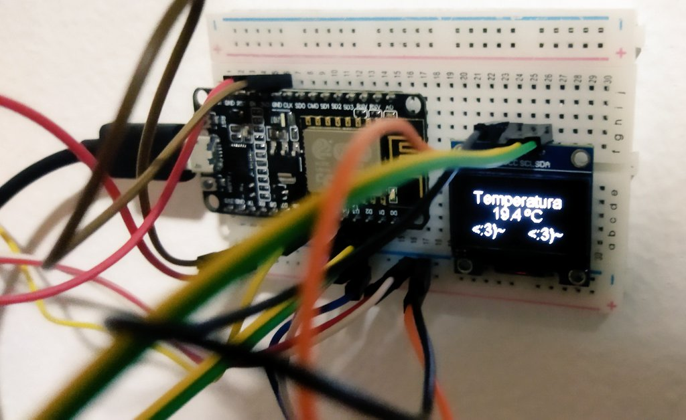

---

## Adafruit IO

O **Adafruit IO** era a central de dados do projeto.

Além de receber as leituras dos sensores, o dashboard permitia acompanhar de uma vez várias coisas que estavam acontecendo na casa: temperatura e umidade interna e externa, chuva, estado das luminárias e a umidade do solo da samambaia.

Também havia controles para alguns dispositivos ligados aos relés.

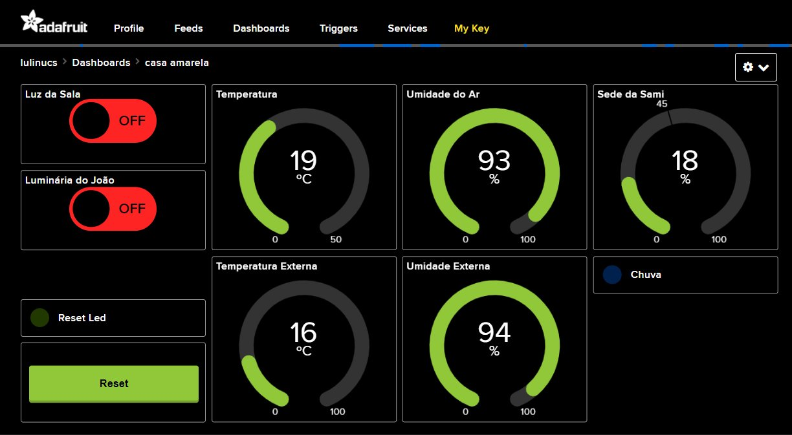

No painel dá para ver um pouco da mistura que era o projeto: no mesmo lugar conviviam coisas como **Luz da Sala**, **Luminária**, temperatura, umidade, chuva e a **Sede da Sami**.

---

## A voz da casa: os bots no Twitter

A parte de que eu mais gosto do projeto veio depois: fazer esses dados virarem uma espécie de personalidade da casa.

Os scripts em Python usavam a biblioteca **Twython** para publicar automaticamente na conta [@espertacasa](https://x.com/espertacasa).

Não era simplesmente um log jogado no Twitter. Os scripts tentavam transformar acontecimentos da casa em mensagens: uma mudança de temperatura, um dia especialmente frio, uma luz que mudou de estado ou uma planta precisando de água.


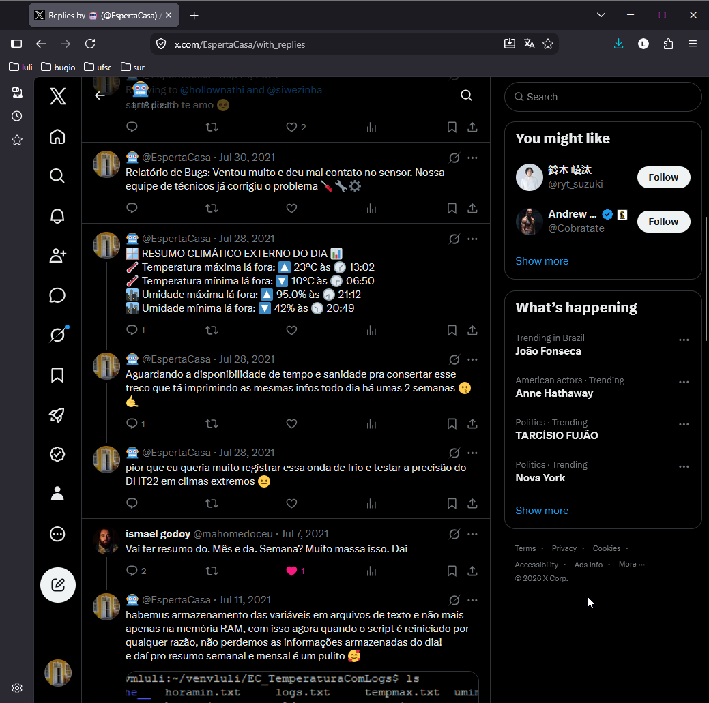

---

## 🌿 A samambaia que pedia água

Uma das moradoras monitoradas da Casa Amarela era uma samambaia.

Coloquei um sensor de umidade na terra do vaso e passei essa leitura para o Adafruit IO. No dashboard ela aparecia como **Sede da Sami**.

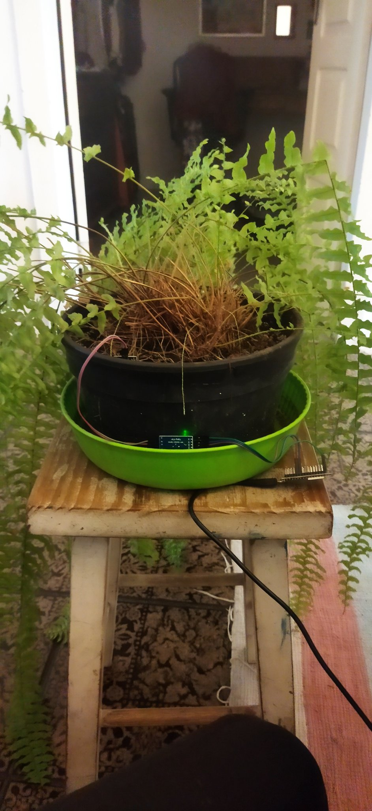

O script `UmidadeSoloSamambaia.py` verificava periodicamente essa leitura. Quando a umidade ficava baixa, a própria samambaia ia ao Twitter pedir água.

Depois de regada, se o sistema detectasse um aumento significativo na umidade do solo, ela agradecia.

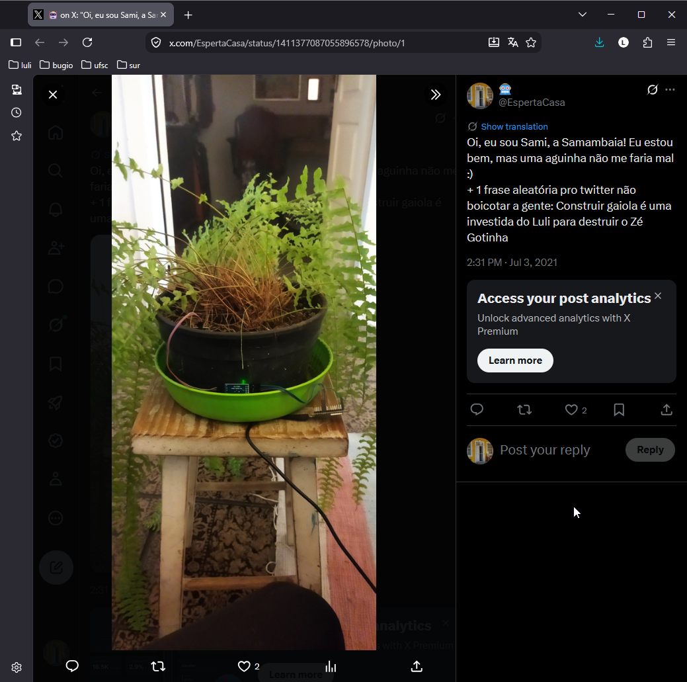

Talvez tenha sido aí que o projeto deixou definitivamente de ser apenas um conjunto de sensores espalhados pela casa.

---

## 🌡️ Temperatura, bichos e a personalidade da casa

Os scripts de temperatura acompanhavam as mudanças ao longo do dia, registravam máximas e mínimas e guardavam também os horários em que elas tinham ocorrido.

À meia-noite, o sistema conseguia montar um resumo climático do dia com temperatura e umidade máximas e mínimas.

Mas havia uma parte bem menos séria.

Nos dias frios, a conta também usava fotos dos animais da casa agasalhados, enrolados em cobertas ou simplesmente sofrendo as consequências meteorológicas da Casa Amarela.

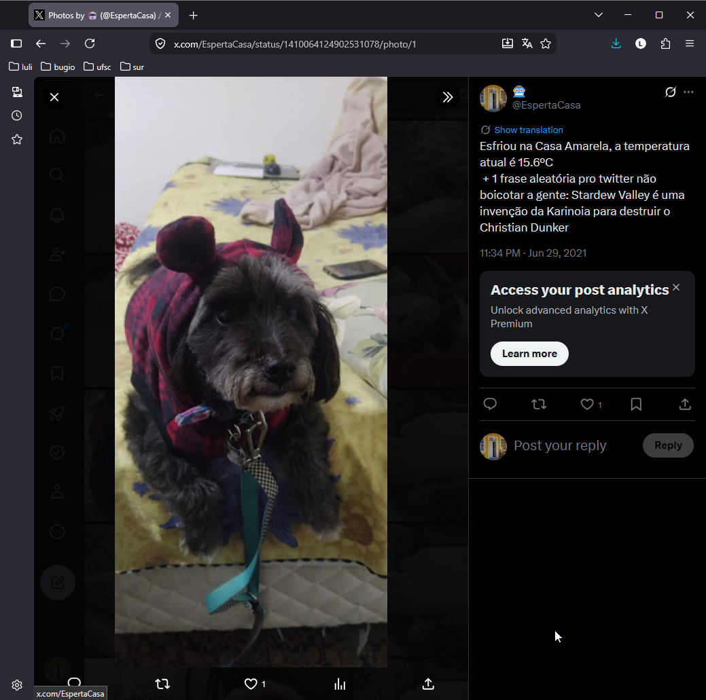

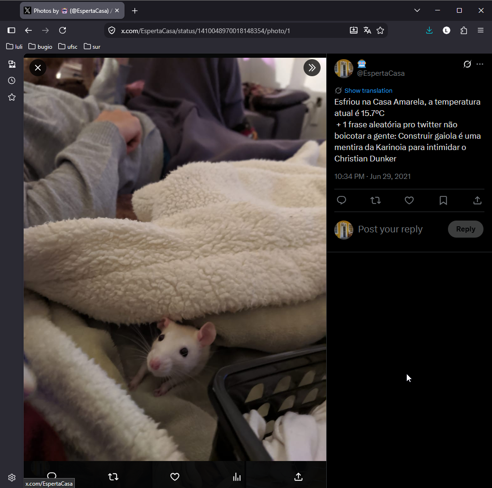


---

## 🎲 O gerador de frases

Publicar repetidamente mensagens praticamente iguais não era uma boa ideia no Twitter, então os bots precisavam variar o texto.

Só que eu não resolvi isso criando simplesmente uma lista de tweets prontos.

Os scripts de temperatura tinham pequenos **geradores combinatórios de frases**. Cada frase era dividida em pedaços e o Python sorteava uma opção de cada conjunto com `random.choice()`.

Por exemplo, para uma queda de temperatura abaixo de 15 °C, existiam grupos como:

```text
"Bota as meia de lã"
"Coloca as luvinhas"
"Hoje tá liberado o aquecedor elétrico"
"Cancela o banho"
"Serve o conhaquinho"

        +

"pois"
"porque"
"pq"

        +

"está frio para um caralho"
"tá uma friaca do djanho"

        +

"na Casa Amarela"
"na Casinha Amarelinha"
"na Casa Amarilla"
"na Yellow House"
"na Casa Esperta"
"aqui na Baia"
```

Então o bot podia montar, por exemplo:

> **Serve o conhaquinho porque tá uma friaca do djanho na Casa Amarela.**

Na execução seguinte, a combinação já podia ser outra.

E não existia um único gerador.

O vocabulário mudava de acordo com **o sentido da mudança de temperatura e a faixa em que ela estava**.

Se estava muito frio e esfriava ainda mais, apareciam meias de lã, luvas, aquecedor e conhaque.

Entre 16 °C e 20 °C, entravam cobertinha, chá e casaquinho.

Se a temperatura caía mas ainda estava relativamente quente, a casa dizia que tinha dado uma refrescada.

Quando passava dos 26 °C, o repertório mudava para coisas como:

> **Bota a ceva pá gelá, os legumo na brrrrrrasa**

> **Prepara a caipirinha**

> **Bota o ventilador no 3**

> **Enche a piscininha de prástico**

Havia até uma situação específica para quando **a temperatura subia, mas continuava frio pra caralho**. O script combinava pedaços como:

> Viva! + A temperatura subiu + um cadinho + na Casa Amarela + contudo + continua + uma friaca do djanho.

Até a parte objetiva variava. Em vez de publicar sempre a mesma estrutura, `random_dados()` alternava entre coisas como:

> Tá 18ºC e a umidade é de 93%

> Faz 18ºC e a umidade relativa do ar é 93%

> Agora tá 18ºC e a umidade do ar é 93%

Era uma solução simples para evitar mensagens repetitivas, mas acabou se tornando uma das partes que mais davam personalidade ao projeto.

A CasaEsperta não tinha apenas dados para publicar. Ela tinha **um jeito próprio de falar sobre eles**.

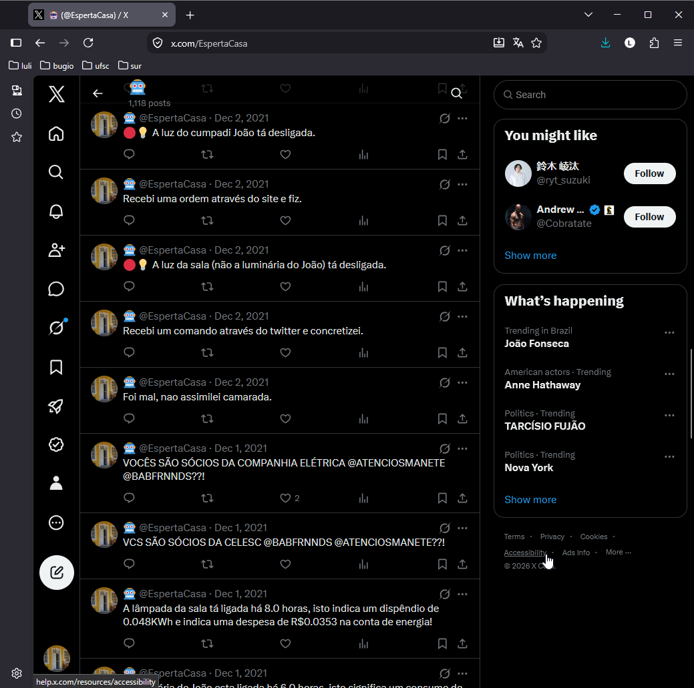

---

## O código

O projeto acabou dividido em pequenos scripts responsáveis por partes diferentes da casa.

- `Luminarias.py` e `LuminariasT.py` acompanhavam o estado das luminárias e reagiam às mudanças.
- `TemperaturaInterna.py` cuidava das leituras internas e de boa parte das mensagens relacionadas ao clima.
- `TemperaturaExterna.py` fazia o acompanhamento das condições externas.
- `UmidadeSoloSamambaia.py` acompanhava a umidade da terra e dava voz à samambaia.
- `auth.py` concentrava a configuração das credenciais usadas pelas APIs.

Os scripts também mantinham alguns valores em arquivos de texto, como máximas e mínimas e os horários em que tinham ocorrido. Era uma maneira simples de preservar esse estado entre execuções.

Não estou modernizando ou refatorando esse código porque isso apagaria justamente uma parte interessante deste repositório: **ele mostra como eu resolvia esses problemas naquele momento**.

---

## Estado atual

O CasaEsperta não está mais em funcionamento.

As integrações, bibliotecas e APIs utilizadas são da época do projeto e algumas mudaram bastante desde então — especialmente a API do Twitter, hoje X. Portanto, este repositório **não deve ser encarado como um projeto pronto para instalar e executar atualmente**.

Também não pretendo atualizar dependências ou adaptar os bots às APIs atuais.

A intenção agora é outra: preservar o projeto.

Ele foi feito antes de ferramentas de IA generativa fazerem parte do cotidiano da programação. Muito do que está aqui surgiu de documentação, pesquisa, tentativa e erro, fios espalhados pela casa e bastante curiosidade.

O código certamente tem coisas que hoje eu faria de outra maneira. E é justamente por isso que quero mantê-lo como está.

Por algum tempo, sensores, relés, ESPs, scripts Python, uma samambaia, cachorros, ratos e algumas frases questionáveis fizeram parte do mesmo sistema distribuído.

**E a Casa Amarela tuitava.**

---

### Arquivo histórico

A antiga conta do projeto continua disponível em:

**[@espertacasa no X/Twitter](https://x.com/espertacasa)**

Este repositório é mantido como registro histórico do projeto original.