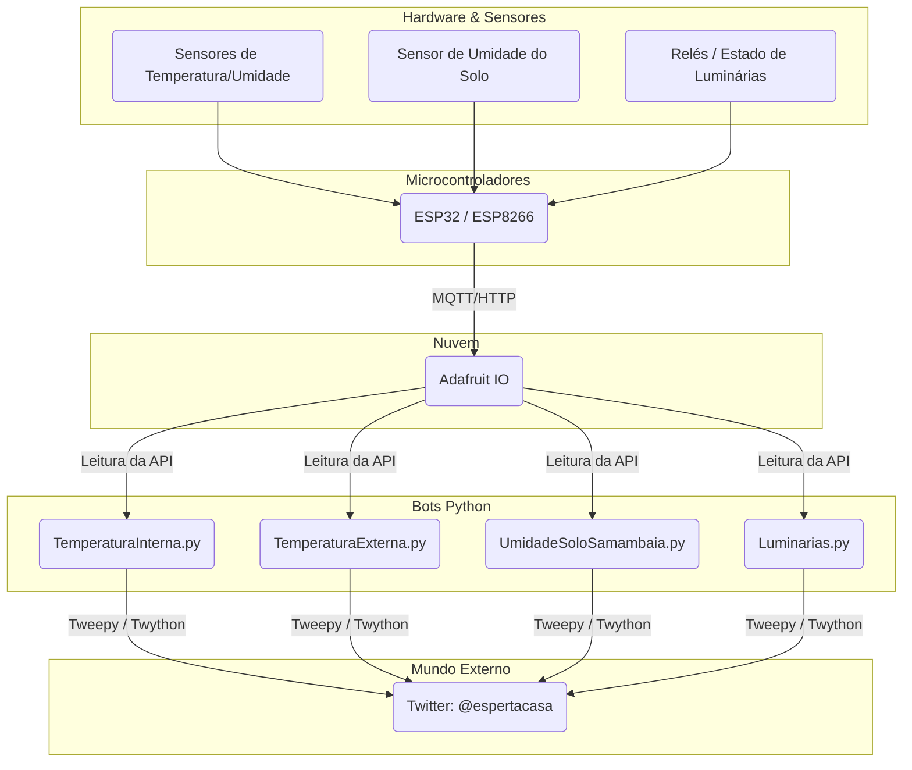
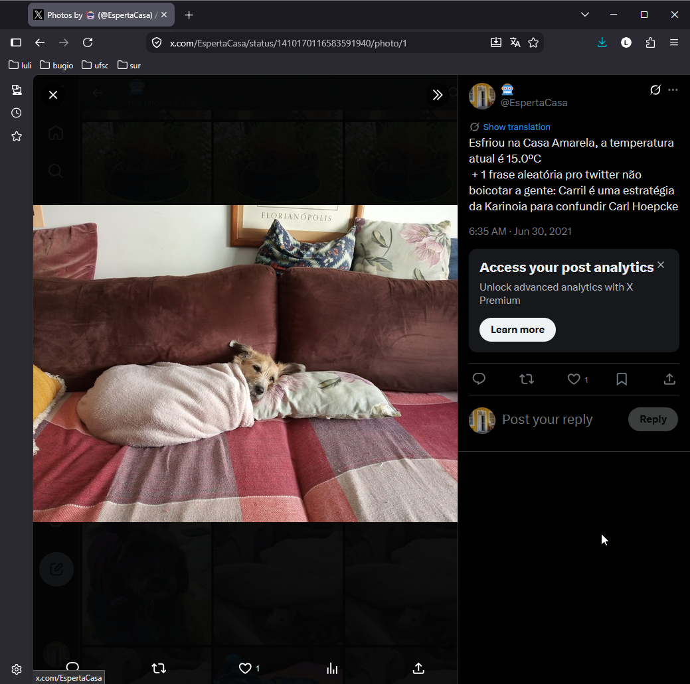

# CasaEsperta 🏡🤖

> **Aviso de Preservação:** Este projeto encontra-se descontinuado e as instruções/scripts aqui presentes são mantidos como um registro histórico. Ele foi criado em 2021, antes da popularização das ferramentas de IA generativas para programação, numa época de muitos experimentos, pesquisas em documentações e tentativas de dar "voz" à minha própria casa. As integrações com APIs (como a do Twitter) provavelmente já não funcionam com o código atual. O objetivo deste repositório hoje é apenas documentar com carinho o que a CasaEsperta foi.

O **CasaEsperta** foi um experimento de automação residencial e Internet das Coisas (IoT) muito particular.

Muito além de apenas encher uma casa com sensores e relés para monitorar o clima e acender lâmpadas, o verdadeiro objetivo do projeto era dar uma **personalidade** para a casa. Para isso, os dados coletados (como temperatura, umidade, e estado das luminárias) não iam apenas para um dashboard estático — eles também ganhavam vida no Twitter através da conta [@espertacasa](https://x.com/espertacasa).

Foi um projeto feito pela pura curiosidade de construir coisas, errando, testando hardware de forma bem caseira e escrevendo scripts em Python para juntar as peças.

---

## 🛠 Como a casa funcionava (Arquitetura Geral)

O funcionamento era dividido entre o hardware (microcontroladores ESP32/ESP8266 + sensores espalhados pela casa), a plataforma do Adafruit IO atuando como "cérebro" de dados, e pequenos bots em Python responsáveis por interagir com o Twitter.

---

## 🔌 Sensores, Dispositivos e o Adafruit IO

Os circuitos foram todos montados inicialmente em protoboards e depois integrados pela casa. As medições envolviam coisas do dia a dia: se estava chovendo, se o quarto estava gelado, se as lâmpadas estavam ligadas e se as plantas estavam com sede.

*Registro da época: montagem dos circuitos com displays exibindo dados antes de integrá-los definitivamente no projeto.*

Todos esses dispositivos enviavam informações para feeds do **Adafruit IO**. O Adafruit funcionava como um painel de controle e histórico. Através do dashboard, eu podia visualizar os dados graficamente, acompanhar as flutuações de temperatura e até mesmo interagir com a automação (acionando relés).

*Dashboard original do Adafruit IO usado como central de monitoramento.*

---

## 🐦 Os bots e a personalidade da casa

O coração do projeto era como esses dados viravam mensagens. Havia quatro scripts principais em Python rodando em loop e consultando o Adafruit.

### 🌿 A samambaia que pedia água (`UmidadeSoloSamambaia.py`)
Uma parte especialmente querida do projeto era a samambaia. Ela possuía um sensor de umidade de solo enfiado na terra do seu vaso. Quando a terra secava (umidade abaixo de 45%), a própria planta ia para o Twitter reclamar e pedir água para os "roomies".

Quando alguém finalmente a regava, e o sensor detectava o aumento da umidade, ela mandava um tweet de agradecimento.

### 🐶 Temperatura, clima e os animais da casa (`TemperaturaInterna.py` e `TemperaturaExterna.py`)
Os bots acompanhavam constantemente as temperaturas. Eles guardavam os registros de máximas e mínimas diárias e mandavam resumos climáticos do dia à meia-noite.

Mas a parte mais legal acontecia quando fazia frio de verdade. Os tweets sobre as baixas temperaturas vinham frequentemente acompanhados por fotos dos animais da casa usando roupinhas de frio ou enrolados nas cobertas.

### 💡 Monitoramento das lâmpadas (`Luminarias.py`)
O sistema também lia as entradas de relés para monitorar as luminárias da casa, anunciando as alterações em tempo real no Twitter, criando o registro do que acontecia na casa física na timeline digital.

### 🎲 A geração de frases aleatórias
Existia um "problema" técnico muito engraçado: o Twitter (hoje X) bloqueava bots que publicavam frases repetidas por considerá-los spam/flood. Para contornar isso, adicionei nos scripts um mecanismo que injetava trechos ou frases completamente sem noção ao final ou no meio dos tweets (como *"nada acontece, feijoada"*, ou gírias aleatórias).

O resultado foi que as informações reais, precisas e sérias da casa (como uma nova temperatura mínima registrada) começaram a aparecer no Twitter junto a comentários absurdos e engraçados, o que ajudou a dar um charme caótico ao projeto.

---

## 📸 Mais memórias do projeto

Alguns registros diretos de como a conta `@espertacasa` interagia:

---

## 💻 Estrutura Histórica do Código

O repositório é composto por:
* `Luminarias.py`: Bot para o estado das luzes.
* `TemperaturaExterna.py`: Registros e resumos climáticos (ambiente externo).
* `TemperaturaInterna.py`: Temperaturas internas com alertas de máximas/mínimas e gerador de frases aleatórias.
* `UmidadeSoloSamambaia.py`: O bot em que a planta ganha vida.
* `auth.py`: (Onde as chaves da API eram salvas).
* `imgs/`: Pasta de preservação das imagens e memórias visuais (recuperadas).

> **Aviso sobre Dependências:**
> Na época (2021), o projeto utilizava bibliotecas como `adafruit-io` e `twython`, conforme especificado no arquivo `requirements.txt` original. Não tente instalar ou rodar isso em 2026. Considere este um museu de código!

---

*“O interessante não é o tamanho do software. É o fato de sensores, microcontroladores, APIs, Python e uma conta do Twitter terem sido combinados para fazer uma casa pequena ganhar uma espécie de voz.”*